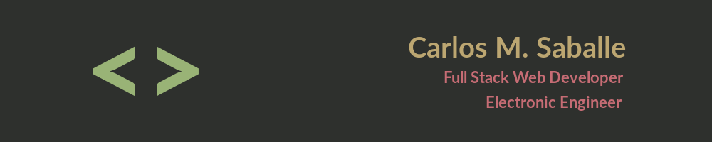

### Hi! Nice to see you! 🧑🏽‍💻😎



My name is Carlos, I'm passionated about software development, I'm a <b>full stack web developer</b> and an <b>electronic engineer</b>, I'm from Colombia 🇨🇴. 
I've worked developing firmware for microcontrollers (PIC and Arduino) and currently I'm dedicated to <b>web development</b>. I'm also interested in expanding my experience/knowledge in cross-platform mobile development.

#### About me in code
```js
const carlossaballe = {
  pronouns: 'he' || 'him',
  code: ['Javascript', 'HTML', 'CSS'],
  tools: [React, React Native, Redux, Node, Moleculer],
  techCommunities: {
      henry: ["Teaching Assistant", "linkedin.com/school/soyhenry/"]
  },
  learning: { Vue.js },
}
```
<!--
 

**carlossaballe/carlossaballe** is a ✨ _special_ ✨ repository because its `README.md` (this file) appears on your GitHub profile.

Here are some ideas to get you started:

- 🔭 I’m currently working on ...
- 🌱 I’m currently learning ...
- 👯 I’m looking to collaborate on ...
- 🤔 I’m looking for help with ...
- 💬 Ask me about ...
- 📫 How to reach me: ...
- 😄 Pronouns: ...
- ⚡ Fun fact: ...
-->

